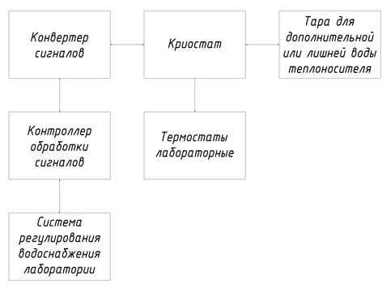
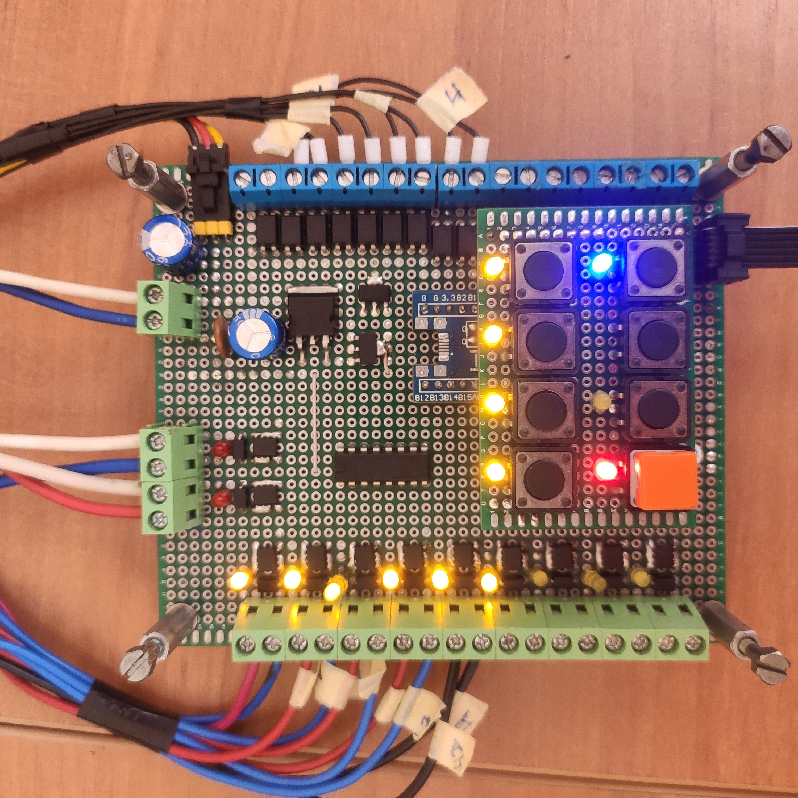
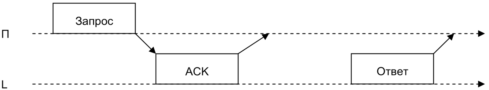
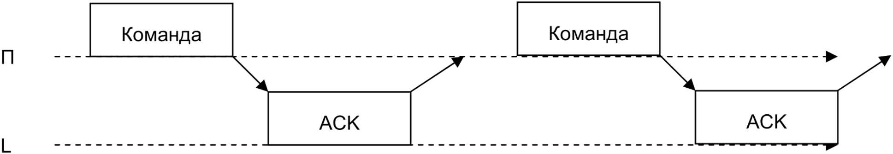
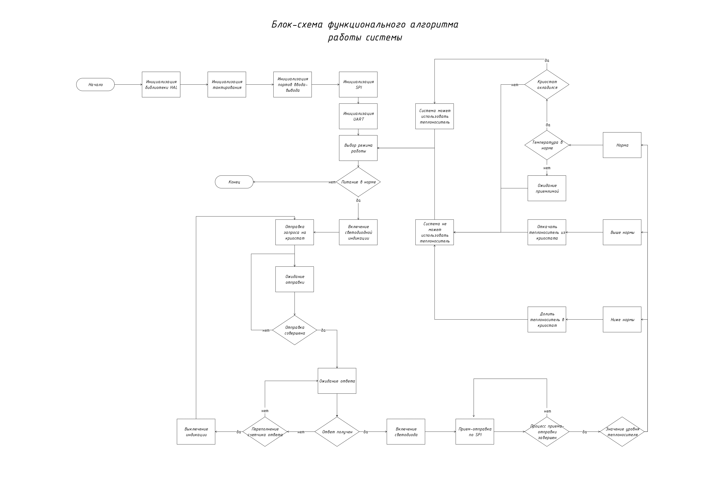
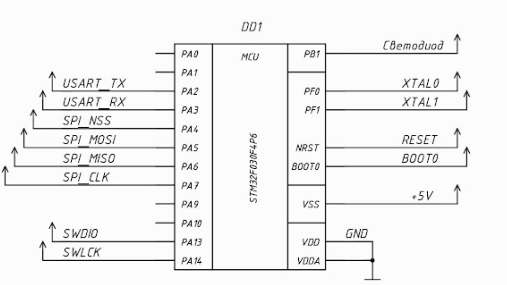
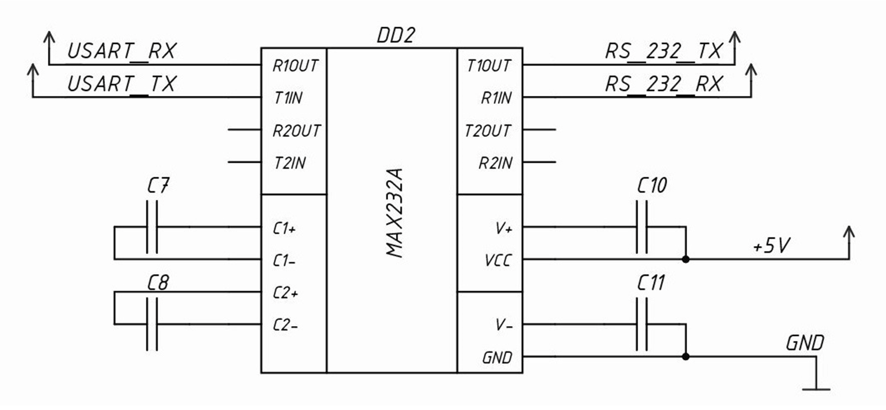

# Cryostat_control_controller
Контроллер управления криостатом
================================
Краткое описание системы
------------------------
Контролер  управления криостатом(на схеме это контроллер обработки сигналов(далее МК2)) включен в следующую структуру.

Работает это следующим образом. От Системы регулирования водоснабжения лаборатории (далее МК1) по интерфейсу SPI поступают сигналы на МК2. Сигналы поступившие на МК2 обрабатываются формирую последовательность байтов и по интерфейсу RS232 опрашивается Криотермостат (на схеме криостат (далее КТС)). КТС выдает ответ о состоянии жидкости в нем (ее наличие, уровень, температуру, температуру которой она должна быть). МК2 выдает простой ответ на МК2 о состоянии жидкости означающий можно ли использовать ее оттуда или нет.

Система работает на связке микроконтроллеров серии STM32F103C8T6 (МК1) и STM32F030F4 (МК2). 
МК1 выполняет роль MASTER,

МК2 соответственно SLAVE.

Обмен данными между МК2 и КТС происходит по схемам:
-------------------------------------------------------

Схема приема-передачи данных для запросов состояния у КТС:

Схема приема-передачи данных для команд у КТС:

Алгоритм работы МК2 на блок схеме далее:
----------------------------------------

Схема подключения выводов к МК2
==========================================================

Схема подключения МК2 к преобразователю USART-RS232
==========================================================

